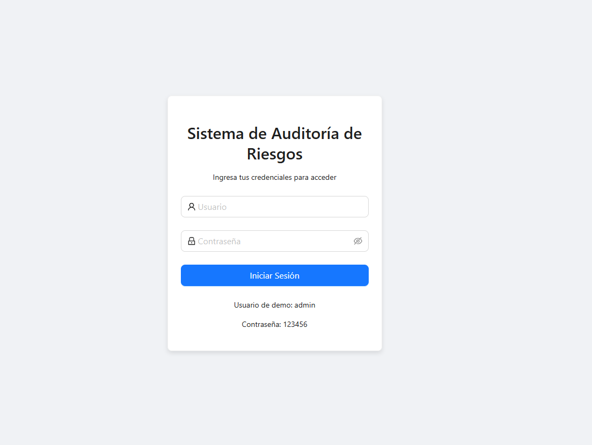
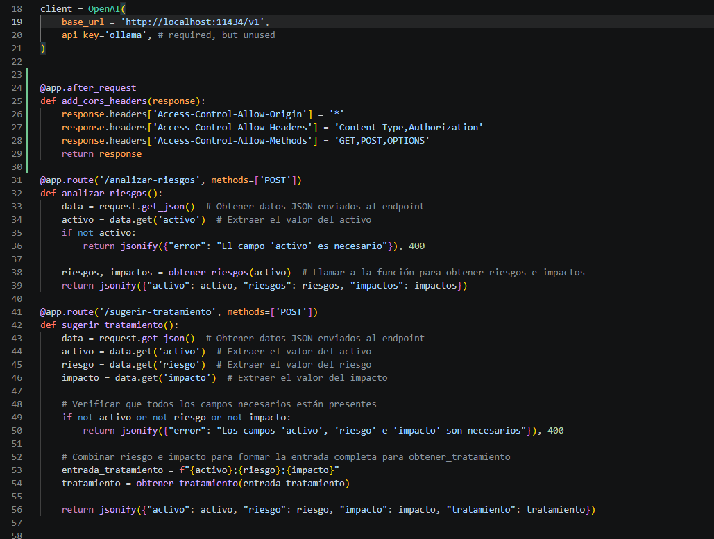
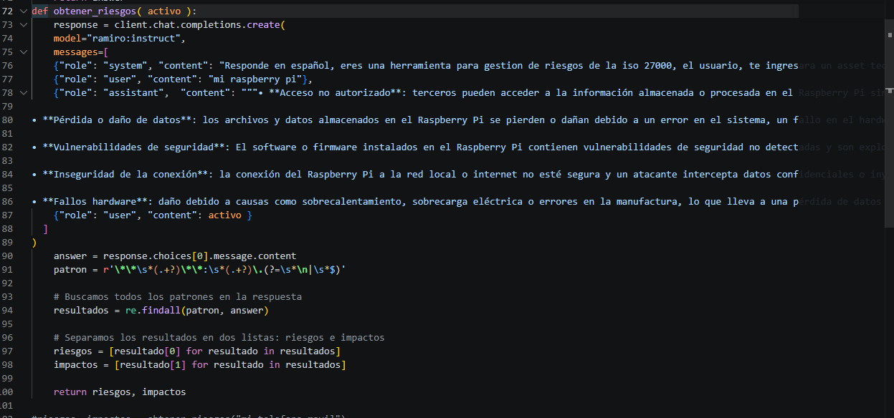
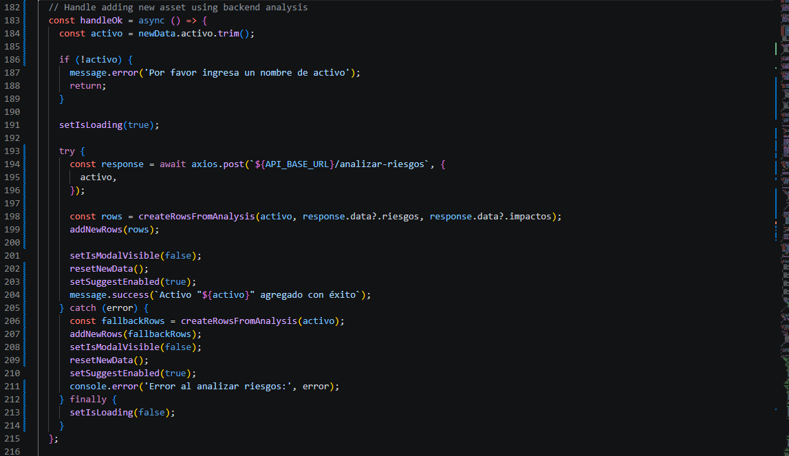
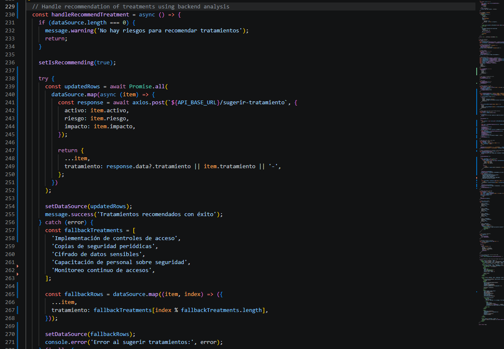
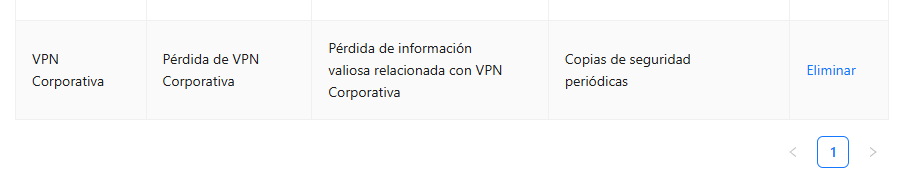
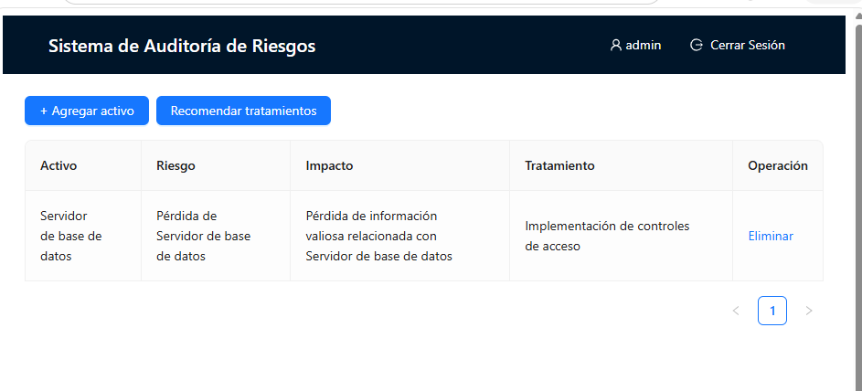
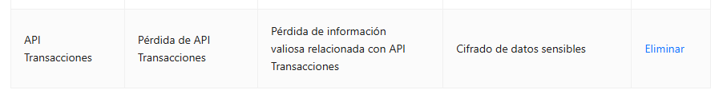
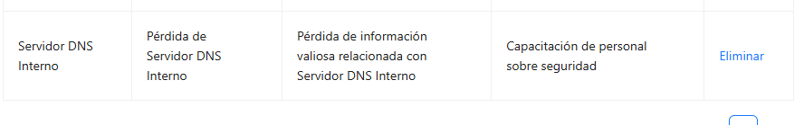
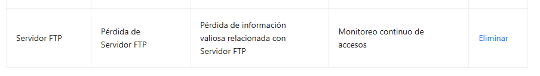

# Informe de Auditoria de Sistemas - Examen de la Unidad I

Nombres y apellidos: Dylan Yariet Tapia Vargas 
Fecha: 22/04/2026
URL GitHub: https://github.com/DylanTapiaVargas999/ExamenU1_Auditoria_Tapia 

## 1. Proyecto de Auditoria de Riesgos

### Login
Evidencia:

Descripcion: Breve explicacion de como se implemento el inicio de sesion ficticio.

### Motor de Inteligencia Artificial
Evidencia:

Descripcion : Se mejoro el sistema integrando IA de extremo a extremo. En el backend se configuraron endpoints para analizar riesgos y sugerir tratamientos usando un modelo local por API compatible. En el frontend se conectaron estas rutas para enviar el activo, recibir riesgos e impactos y luego completar automaticamente los tratamientos por cada fila. Ademas, se mantuvo un flujo de respaldo para que la operacion no se detenga si la respuesta del modelo demora o falla.

### Caso.md

## 2. Hallazgos

### Activo 1: VPN Corporativa 

### Activo 2:Servidor de base de datos 

### Activo 3: API Transacciones

### Activo 4: Servidor DNS Interno 

### Activo 5: Servidor FTP

## Anexo 1: Activos de informacion

| # | Activo | Tipo |
|---|---|---|
| 1 | Servidor de base de datos | Base de Datos |
| 2 | API Transacciones | Servicio Web |
| 3 | Aplicacion Web de Banca | Aplicacion |
| 4 | Servidor de Correo | Infraestructura |
| 5 | Firewall Perimetral | Seguridad |
| 6 | Autenticacion MFA | Seguridad |
| 7 | Registros de Auditoria | Informacion |
| 8 | Backup en NAS | Almacenamiento |
| 9 | Servidor DNS Interno | Red |
| 10 | Plataforma de Pagos Moviles | Aplicacion |
| 11 | VPN Corporativa | Infraestructura |
| 12 | Red de Cajeros Automaticos | Infraestructura |
| 13 | Servidor FTP | Red |
| 14 | CRM Bancario | Aplicacion |
| 15 | ERP Financiero | Aplicacion |
| 16 | Base de Datos Clientes | Informacion |
| 17 | Logs de Seguridad | Informacion |
| 18 | Servidor Web Apache | Infraestructura |
| 19 | Consola de Gestion de Incidentes | Seguridad |
| 20 | Politicas de Seguridad Documentadas | Documentacion |
| 21 | Modulo KYC (Know Your Customer) | Aplicacion |
| 22 | Contrasenas de Usuarios | Informacion |
| 23 | Dispositivo HSM | Seguridad |
| 24 | Certificados Digitales SSL | Seguridad |
| 25 | Panel de Administracion de Usuarios | Aplicacion |
| 26 | Red Wi-Fi Interna | Red |
| 27 | Sistema de Control de Acceso Fisico | Infraestructura |
| 28 | Sistema de Video Vigilancia | Infraestructura |
| 29 | Bot de Atencion al Cliente | Servicio Web |
| 30 | Codigo Fuente del Core Bancario | Informacion |
| 31 | Tabla de Usuarios y Roles | Informacion |
| 32 | Documentacion Tecnica | Documentacion |
| 33 | Manuales de Usuario | Documentacion |
| 34 | Script de Backups Automaticos | Seguridad |
| 35 | Datos de Transacciones Diarias | Informacion |
| 36 | Herramienta SIEM | Seguridad |
| 37 | Switches y Routers | Red |
| 38 | Plan de Recuperacion ante Desastres | Documentacion |
| 39 | Contratos Digitales | Informacion Legal |
| 40 | Archivos de Configuracion de Servidores | Informacion |
| 41 | Infraestructura en la Nube | Infraestructura |
| 42 | Correo Electronico Ejecutivo | Informacion |
| 43 | Panel de Supervision Financiera | Aplicacion |
| 44 | App Movil para Clientes | Aplicacion |
| 45 | Token de Acceso a APIs | Seguridad |
| 46 | Base de Datos Historica | Informacion |
| 47 | Entorno de Desarrollo | Infraestructura |
| 48 | Sistema de Alertas de Seguridad | Seguridad |
| 49 | Configuracion del Cortafuegos | Seguridad |
| 50 | Redundancia de Servidores | Infraestructura |